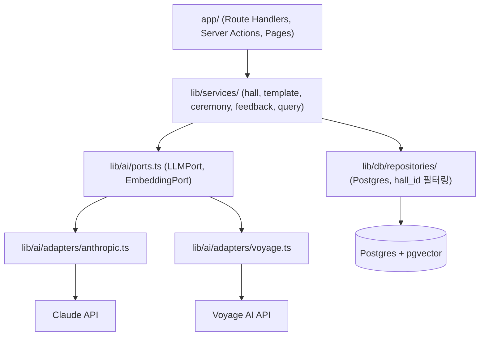
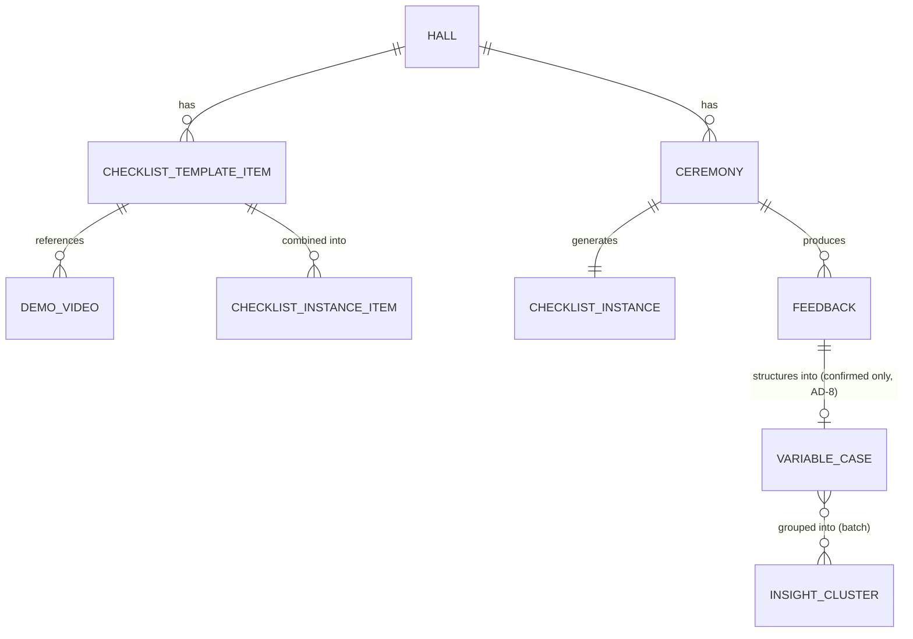

# Architecture Spine — 웨딩홀 스캔 오퍼레이터 인수인계 시스템

## Design Paradigm

**계층형(Layered) Next.js 모놀리스**로 관리자·오퍼레이터 화면과 API를 한 배포 단위에서 서비스한다. 딱 한 경계만 **Ports-and-Adapters**로 분리한다 — AI(LLM 생성 + 임베딩) 연동부. PRD §6 Cost의 "벤더 중립" 요구를 만족시키기 위한 유일한 구조적 장치다.



의존 방향: `app/` → `lib/services/` → (`lib/db/` | `lib/ai/ports.ts`). 역방향 의존 금지. `lib/services/`는 벤더 SDK(`@anthropic-ai/sdk`, voyage 클라이언트)를 직접 import하지 않는다 — 반드시 `lib/ai/ports.ts`를 통한다.

## Invariants & Rules

### AD-1 — AI 연동은 Ports-and-Adapters 뒤에서만

- **Binds:** FR-6, FR-7, FR-9, FR-10 (LLM 생성·임베딩을 쓰는 모든 기능), `lib/ai/*`, `lib/services/*`
- **Prevents:** 서비스 코드가 특정 벤더 SDK(Claude, Voyage)를 직접 호출해, 벤더 교체 시 비즈니스 로직까지 손대야 하는 상황 — PRD §6 Cost "벤더 중립" 위반.
- **Rule:** 모든 LLM 생성·임베딩 호출은 `lib/ai/ports.ts`의 `LLMPort` / `EmbeddingPort` 인터페이스를 거친다. `lib/services/*`는 `@anthropic-ai/sdk`나 voyage 클라이언트를 직접 import할 수 없다 — 오직 포트 인터페이스만 import한다(`eslint-plugin-boundaries` 또는 `no-restricted-imports`로 `lib/services/**`에서 벤더 SDK import를 CI에서 차단, 코드리뷰 관행에만 의존하지 않는다). 벤더 교체는 `lib/ai/adapters/*`에 새 어댑터를 추가하고 포트 바인딩을 바꾸는 것으로 끝나야 한다.

  포트 시그니처는 다음으로 고정한다(두 어댑터가 독립적으로 정의하면 스토리 간 컴파일 타임 불일치가 발생하므로 여기서 못박는다):
  - `LLMPort.generate(input: GenerateInput): Promise<GenerateResult>` — `responseSchema`를 선택적으로 받아 FR-6/7의 raw-text 응답과 FR-9의 5필드 구조화 응답을 모두 커버한다. `GenerateResult`는 근거로 쓰인 변수 케이스 ID(있으면)를 포함해 FR-7의 "관련 사례 없음" 판단을 UI가 신뢰할 수 있게 한다.
  - `LLMPort.generateStream(input: GenerateInput): AsyncIterable<GenerateChunk>` — FR-6/7 Route Handler 전용.
  - `EmbeddingPort.embed(texts: string[]): Promise<number[][]>` — 단건도 길이 1 배열로 통일(배치 우선 시그니처, FR-10의 N건 배치 임베딩과 FR-6/7의 단건 질의를 같은 메서드로 처리). 출력 차원은 어댑터 내부에서 1024로 고정하며 호출부는 차원을 선택할 수 없다(§Stack 참고) — pgvector 컬럼과 어긋나는 차원의 벡터가 섞이는 것을 원천 차단.

### AD-2 — 리포지토리 레이어가 DB 접근을 독점하고, 홀 격리는 거기서 강제

- **Binds:** FR-1, FR-2, FR-3, FR-4, FR-5 (홀·템플릿·예식·인스턴스), `lib/db/*`
- **Prevents:** 서비스나 라우트가 Postgres를 직접 쿼리하다 `hall_id` 필터를 빠뜨려, 한 홀의 템플릿·예식이 다른 홀 화면에 새어나가는 것(§3 "홀" — 템플릿은 홀 간 절대 섞이지 않아야 함).
- **Rule:** `lib/services/*`는 SQL/ORM을 직접 쓰지 않고 `lib/db/repositories/*`만 호출한다. 홀 종속 엔티티(`checklist_templates`, `checklist_template_items`, `demo_videos`, `ceremonies`, `checklist_instances`, `checklist_instance_items`)의 리포지토리 함수는 `hallId`를 필수 첫 인자로 받고, 해당 테이블의 모든 조회/수정 쿼리는 `WHERE hall_id = $hallId`를 포함한다. 이 격리는 애플리케이션 레이어에서만 강제되며 Postgres RLS는 쓰지 않는다(AD-6 참고, v2에서 재검토).

  **스키마 확정(JOIN 대체 금지):** `checklist_instances`는 생성 시점에 소속 `hall_id`를 자신의 컬럼으로 반드시 저장한다(예식→홀 JOIN으로 대체하지 않는다 — 두 전략이 섞이면 마이그레이션이 충돌하거나 이중 격리 전략이 공존하게 된다). **2-hop 재검증 필수:** `checklist_instance_items`에 항목을 추가/제거하는 모든 쓰기 경로(FR-5 당일 수동 추가 포함)는 `instance.hall_id = template_item.hall_id`를 명시적으로 재검증해야 한다 — `instance_id`만으로 항목 추가를 허용하고 이 재검증을 생략하는 구현은 AD-2 위반이다(§3 "템플릿은 홀 간 절대 섞이지 않아야 함"으로 직결되는 안전장치).

### AD-3 — 역할은 오퍼레이터/관리자 2종뿐

- **Binds:** 전체 라우트, better-auth 세션, all FRs
- **Prevents:** 향후 작업자가 임의로 "선임" 같은 중간 권한 티어를 만들어 인가 로직이 갈라지는 것.
- **Rule:** 역할은 정확히 두 가지다 — `operator`(질의 FR-6/7 + 피드백 FR-8/9 + 체크리스트 인스턴스 읽기 전용 열람)와 `admin`(홀·템플릿·예식 CRUD FR-1~5 + 인사이트 FR-10/11). 세분화된 권한 티어를 v1에 추가하지 않는다. `신입`/`선임` 구분은 시스템에 존재하지 않는다(2026-07-24 PRD 변경, §3 참고).

### AD-4 — 시연 영상 업로드는 서버 바디 제한을 우회한다

- **Binds:** FR-2, FR-3
- **Prevents:** Next.js Server Action/Route Handler로 영상 바이트를 프록시하다 Vercel Functions의 4.5MB 요청 바디 상한에 걸려 대용량 시연 영상(최대 500MB 가정, §12) 업로드가 실패하는 것.
- **Rule:** 영상 업로드는 `@vercel/blob/client`의 클라이언트 사이드 업로드(멀티파트, 최대 5TB)를 사용한다. 서버 라우트는 업로드 토큰만 발급하고 파일 바이트를 절대 프록시하지 않는다. **`demo_videos` 행 쓰기 권한:** 업로드 완료 후 DB에 `demo_videos` 행을 쓰는 것은 반드시 `onUploadCompleted` 서버 콜백에서만 한다 — 클라이언트가 업로드 완료 후 직접 보고하는 blob URL을 그대로 신뢰해 저장하는 경로는 금지한다(신뢰할 수 없는 클라이언트 입력으로 다른 홀의 기존 영상 URL을 재사용하는 등 AD-2의 홀 격리를 우회할 수 있음).

### AD-5 — 오프라인: 체크리스트 조회만 캐시, AI 질의는 온라인 전용

- **Binds:** §5 가용성 NFR, FR-6, FR-7
- **Prevents:** AI 질의(FR-6/7)가 오프라인에서도 동작하는 것처럼 설계하는 것(불가능 — Service Worker 없음), 혹은 반대로 체크리스트 조회가 재로드 시마다 네트워크에 의존해 첫 로드 실패 시 아무것도 못 보는 것.
- **Rule:** 체크리스트 인스턴스는 최초 로드 성공 시 클라이언트 메모리/localStorage에 캐시되고, `navigator.onLine`이 false이거나 fetch가 실패하면 캐시에서 렌더링한다. AI 질의와 피드백 저장은 항상 네트워크가 필요하며, 실패 시 명시적 오류를 즉시 노출한다(조용한 재시도 금지, §14 Error 상태 참고). **알려진 한계:** 이 방식은 앱을 완전히 새로고침한 시점에 오프라인이면 캐시가 없어 체크리스트도 볼 수 없다 — 정식 PWA/Service Worker가 아니므로 PRD §5 NFR을 부분적으로만 충족한다(사용자가 명시적으로 선택한 트레이드오프).

  **온라인 상태에서의 재검증(stale-while-revalidate):** 화면 마운트 시 및 60초 고정 간격마다 캐시를 즉시 렌더링하면서 백그라운드로 재검증 fetch를 보낸다. 성공하면 캐시를 교체하고 `motion-instant`로 조용히 갱신하며, 실패하면 기존 캐시를 유지한 채 위 오프라인 경로로 진입한다. FR-5(당일 수동 항목 추가/제외)가 이미 열려 있는 태블릿 화면에 반영되는 것은 이 재검증 주기에 의존한다(즉시 push는 v1 범위 밖) — "캐시는 최초 1회만 쓰고 이후 갱신 없음"으로 구현하는 것은 라이브 예식 중 관리자의 변경이 반영되지 않는 안전 문제이므로 AD-5 위반이다.

### AD-6 — 변수 케이스 검색·인사이트 클러스터링은 사업체 전체 범위, 홀은 태그로만 표시

- **Binds:** FR-6, FR-7, FR-9, FR-10
- **Prevents:** 두 기능(실행 중 질의 vs 인사이트)이 서로 다른 검색 범위(하나는 홀 필터링, 하나는 전체)를 독립적으로 구현해 결과가 일관되지 않는 것.
- **Rule:** pgvector 유사도 검색과 클러스터링 쿼리는 홀 필터 없이 사업체 전체 `변수_케이스`/`피드백`을 대상으로 한다. 각 결과/클러스터 항목은 `hall_id`를 표시용 태그로만 붙인다. PRD §11 Open Q7 — 대표 확인 전까지의 기본값이며, 확정되면 이 AD를 갱신한다.

### AD-7 — `insight_clusters`는 단일 소유자·upsert 방식으로만 쓴다

- **Binds:** FR-10, FR-11, `lib/services/insight.ts`
- **Prevents:** 재계산 배치가 delete-then-reinsert로 구현되어 화면에 노출 중(§14 "기존 인사이트는 갱신 중에도 계속 보임" 계약과 충돌)되거나, 향후 수동 재계산 트리거가 추가될 때 배치와 동시 실행되어 중복/부분 클러스터가 생기는 것.
- **Rule:** `insight_clusters`는 오직 `lib/services/insight.ts::recomputeInsights()`만 쓸 수 있다(다른 서비스·라우트에서 직접 INSERT/UPDATE/DELETE 금지). 재계산은 기존 클러스터를 먼저 삭제하지 않고, 신규 계산 결과를 커밋 시점에 원자적으로 교체하는 upsert 방식으로 동작한다. 동시 실행 방지를 위해 상태 행 또는 advisory lock으로 중복 실행을 차단한다. `cluster_id`의 실행 간 안정성은 v1에서 보장하지 않는다(매번 재계산 — 안정성이 필요해지면 이 AD를 갱신).

### AD-8 — `variable_case`는 확정된 피드백에서만 생성된다 (안전 경계)

- **Binds:** FR-6, FR-7, FR-8, FR-9 — PRD §6 Safety의 핵심 안전장치("관련 사례가 없을 때 임의 사례를 근거처럼 제시하지 않는다")를 지키는 경계.
- **Prevents:** 임시저장(draft) 상태의, 아직 오퍼레이터가 확인하지 않은 자동 구조화 결과가 검색 인덱스에 들어가 다른 오퍼레이터에게 검증된 사례처럼 제시되는 것 — 라이브 예식 중 실제 사고로 이어질 수 있는 안전 결함.
- **Rule:** `feedback` 테이블은 `status: draft | confirmed`를 가진다. `variable_case` 레코드는 오퍼레이터가 FR-9 구조화 결과를 확인/저장(확정, `status='confirmed'`)한 시점에만 생성되며, 이때만 임베딩되어 FR-6/7 검색 인덱스에 들어간다. Draft 상태의 `feedback`은 서버에 저장되어 나중에 이어 쓸 수 있지만(FR-8), `variable_case`를 생성하지 않고 인덱스에도 절대 포함되지 않는다. (ERD 참고: `FEEDBACK`↔`VARIABLE_CASE`는 0..1 관계이지 1:1이 아니다.)

### AD-9 — 계약 형태 조건부 항목 포함은 `checklist_template_items`의 조건 컬럼으로 표현한다

- **Binds:** FR-5
- **Prevents:** "계약 형태에 맞는 항목만 조합"(FR-5)의 데이터 표현을 스토리마다 다르게 발명하는 것(JSON 배열 vs 정규화 규칙 테이블 vs `ceremony.ts`에 하드코딩된 if문) — PRD FR-2 Notes가 UI만 UX 단계로 미뤘을 뿐, 이 데이터 형태 자체는 이번 스파인이 정해야 하는 몫이다.
- **Rule:** `checklist_template_items`에 `applicable_contract_conditions JSONB` 컬럼을 둔다(예: `{"requires_officiant": true}`). 인스턴스 생성 시 `ceremony`의 계약 형태 필드와 부분집합 매칭(subset match)으로 포함 여부를 결정한다. 계약 형태 필드 수가 적어(주례 유무, 이벤트 추가 등) 정규화된 규칙 테이블은 v1에서 과설계로 보고 채택하지 않는다.

### AD-10 — 배포·환경·배치 실행

- **Binds:** 전체 배포 파이프라인, FR-10(일 1회 배치)
- **Prevents:** Preview 배포가 프로덕션 DB를 공유해 스키마 마이그레이션이 충돌하거나 실제 데이터를 오염시키는 것; FR-10 배치가 서버리스 배포 모델과 맞지 않는 방식(상시 실행 워커 등)으로 두 스토리가 서로 다르게 구현되는 것.
- **Rule:**
  - **환경/DB 토폴로지:** Vercel Preview 배포마다 Neon의 Vercel 통합이 제공하는 브랜치별 자동 브랜칭을 사용한다(Preview는 각자 격리된 DB 브랜치, Production은 별도 브랜치). Preview 간 데이터 공유 없음.
  - **마이그레이션:** `drizzle-kit generate`로 생성한 마이그레이션은 CI(빌드 단계)에서 배포 전에 적용한다. 마이그레이션 실패 시 배포를 차단한다(실패한 스키마로 배포되는 상태 금지).
  - **FR-10 배치 실행:** Vercel Cron Job이 공유 시크릿 헤더로 보호된 Route Handler(`/api/cron/insight-recompute`)를 호출하는 방식으로 구현한다(장기 실행 워커 금지 — 서버리스 배포 모델과 불일치).
  - **관측성:** AI 질의 실패(FR-6/7 타임아웃·오류)와 "관련 사례 없음" 저신뢰 응답은 구조화된 JSON 로그로 구분 가능한 이벤트 타입을 남긴다(알림 연동은 v1 범위 밖, Deferred).
  - **시크릿:** `ANTHROPIC_API_KEY`, `VOYAGE_API_KEY`는 Vercel 환경별(Preview/Production) 별도 값으로 관리한다.

## Consistency Conventions

| Concern | Convention |
| --- | --- |
| Naming (entities, files) | DB 테이블은 영문 snake_case, ERD 엔티티와 1:1(`halls`, `checklist_templates`, `checklist_template_items`, `demo_videos`, `ceremonies`, `checklist_instances`, `checklist_instance_items`, `feedback`, `variable_cases`, `insight_clusters`). `checklist_items`처럼 템플릿 항목과 인스턴스 항목을 뭉뚱그리는 이름은 금지(AD-2 참고). TS 타입/컴포넌트는 PascalCase; 파일명은 kebab-case. 도메인 용어는 PRD §3 용어집과 1:1 매칭(홀=`hall`, 변수 케이스=`variable_case`). |
| Data & formats (ids, dates, error shapes) | PK는 UUID v4. 타임스탬프는 ISO 8601 UTC. API 오류 응답은 `{ error: { code: string, message: string } }` 단일 봉투 형식. |
| State & cross-cutting (mutation, auth, config) | 관리자 CRUD(FR-1~5, FR-11)는 Server Actions. AI 질의(FR-6/7)·구조화(FR-9)는 지연시간·타임아웃 제어가 필요해 Route Handler(스트리밍 가능)로 분리. 인증은 better-auth 세션 쿠키, 미들웨어에서 role 체크. 환경변수는 Vercel 프로젝트 env로 관리(ANTHROPIC_API_KEY, VOYAGE_API_KEY, DATABASE_URL 등 시크릿은 코드에 하드코딩 금지). |

## Stack

| Name | Version |
| --- | --- |
| Next.js (App Router, TypeScript) | 16.2.11+ (2026-07-24 웹 검증 — 세션 시점 최신 stable, 2026-07 보안 패치 포함) |
| Postgres + pgvector | Neon (Vercel Marketplace 경유, 2026-07-24 웹 검증 — pgvector 전 티어 무료) |
| Drizzle ORM | 0.31+ (`vector` 컬럼 타입 + `cosineDistance`는 0.31부터 지원, 2026-07-24 웹 검증) |
| better-auth | 최신 stable |
| @vercel/blob | 최신 stable (client upload) |
| @anthropic-ai/sdk | 최신 stable — `claude-sonnet-5`(FR-6/7 실시간 응답), `claude-haiku-4-5`(FR-9 배치 구조화). 기본 권장 모델 `claude-opus-4-8` 대신 Sonnet/Haiku를 택한 근거: FR-6/7은 예식 진행 중 p95 5초 응답이 요구되어(§4.3 `[ASSUMPTION]`) 저지연이 Opus 대비 우선하고, FR-9는 저빈도·저복잡도 배치 구조화라 Haiku로 충분함 — PRD §6 Cost "AI가 필요한 곳에만" 원칙과 일치하는 비용/지연 트레이드오프. |
| Voyage AI embeddings | `voyage-3.5`, 1024차원 (Matryoshka 2048/1024/512/256 중 선택) |
| 배포 | Vercel (Preview + Production) |

## Structural Seed

```text
apps/
  web/
    app/
      (admin)/            # 대표: 홀·템플릿·예식·인사이트
      (operator)/          # 오퍼레이터: 체크리스트 조회·질의·피드백 (태블릿)
      api/
        query/              # FR-6/7 Route Handler (스트리밍, AI 질의)
        feedback/           # FR-8/9 Route Handler (구조화)
    lib/
      services/             # hall, template, ceremony, feedback, query, insight
      ai/
        ports.ts            # LLMPort, EmbeddingPort
        adapters/
          anthropic.ts
          voyage.ts
      db/
        schema.ts            # Drizzle 스키마
        repositories/         # hall_id 필터링 쿼리 함수
    middleware.ts             # better-auth 세션 + role 체크
```

### 핵심 엔티티 ERD



## Capability → Architecture Map

| Capability / Area | Lives in | Governed by |
| --- | --- | --- |
| FR-1 홀 등록 | `lib/services/hall.ts`, `lib/db/repositories/hall.ts` | AD-2 |
| FR-2/3 템플릿·영상 | `lib/services/template.ts`, `(admin)/templates`, `@vercel/blob` | AD-2, AD-4 |
| FR-4/5 예식·인스턴스 | `lib/services/ceremony.ts` | AD-2, AD-9 |
| FR-6/7 실행 중 질의 | `api/query/route.ts`, `lib/ai/ports.ts` | AD-1, AD-5, AD-6, AD-8 |
| FR-8/9 피드백·구조화 | `api/feedback/route.ts`, `lib/ai/ports.ts` | AD-1, AD-6, AD-8 |
| FR-10/11 인사이트 | `lib/services/insight.ts`(일 1회 배치, AD-10 Cron) | AD-1, AD-3, AD-6, AD-7 |
| 인증·권한 | `middleware.ts`, better-auth | AD-3 |
| 배포·환경·마이그레이션 | Vercel + Neon 브랜칭, CI 마이그레이션 | AD-10 |

## Deferred

- **RLS 재검토** — v2에서 타사(멀티테넌트) 확장 시 애플리케이션 레이어 `hall_id` 필터링만으로 부족할 수 있음. 그때 Postgres RLS 또는 스키마 분리 재검토(PRD §8.2).
- **정식 오프라인(PWA/Service Worker)** — 홀 내 와이파이가 실제로 불안정한 것으로 확인되면(PRD §11 Q5) AD-5를 재작성.
- **계약 형태별 항목 포함/제외 규칙 설정 "UI"** — 데이터 표현은 AD-9로 확정됨; 관리자가 이 조건을 편집하는 화면 설계만 UX 단계로 남는다(PRD §4.1 NOTE FOR PM).
- **변수 케이스/인사이트 홀별 분리 여부** — PRD §11 Q7, 대표 확인 후 AD-6 갱신.
- **홀 삭제 정책 세부 구현(비활성화 플래그 vs soft delete 컬럼 설계)** — PRD §11 Q8, 스토리 단계에서 확정.
- **인사이트 → 템플릿 자동 승격 워크플로우** — v2 범위(PRD §8.2), 이번 스파인은 다루지 않음.
- **비용 상한·레이트 리밋** — PRD §6 Cost에 예산 상한 미정. AI 호출 빈도가 낮다는 가정(§6)이 깨지면 재검토.
- **데이터 보존/아카이브 정책** — PRD §11 Q2, 착수 전 확정 필요.
- **AI 실패 알림/모니터링 연동** — AD-10은 구조화 로깅까지만 정한다. 실제 알림 채널(Slack, PagerDuty 등)은 v1 범위 밖.
- **`insight_clusters` 재계산 트리거를 관리자 수동 버튼으로 노출할지** — v1은 일 1회 배치만(FR-10). 수동 트리거를 추가하게 되면 AD-7의 동시성 잠금이 이미 이를 커버한다.
